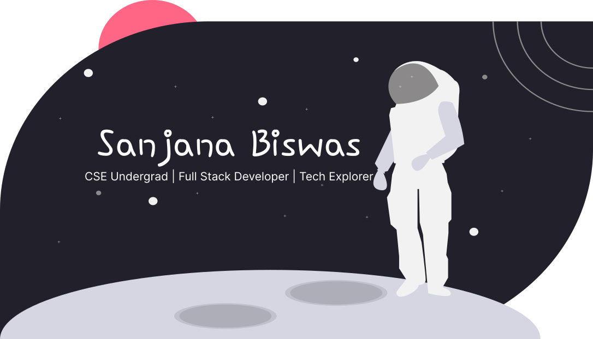

  

<h1 align="center">🌙 Sanjana Biswas</h1>

<em>CSE Undergrad | Full Stack Developer | Tech Explorer</em>

I'm a Computer Science student passionate about building practical, user-centered software. My interests span full-stack development, AI/ML, and creative projects that combine logic and design. I enjoy solving problems and creating meaningful digital experiences.

---

## ⚒️ Technical Skills

**Languages**  
C · C++ · Python · JavaScript · SQL

**Web & Frameworks**  
React.js · Node.js · Express.js · Firebase · Streamlit · Flask (basic)

**Tools & Platforms**  
Git · VS Code · Supabase · MongoDB · MySQL · Postman · AWS (beginner)

**Libraries**  
pandas · NumPy · scikit-learn (basic) · Matplotlib

---

## 📌 Selected Projects

### 🌿 PlantPal (Ongoing)
A full-stack plant care app with reminder scheduling, image uploads to Supabase, and user authentication. Built for SIH 2024.

> React · Node.js · Express · Prisma · Supabase · JWT Auth

### 🧠 Mental Health Classification
Built a BERT-based classifier for emotional state detection from text. Achieved 92% accuracy and deployed with Streamlit.

> Python · Hugging Face · PyTorch · Streamlit

### 🧪 Quiz App
A quiz platform with dynamic API questions, real-time scoring, and smooth UX navigation.

> React · Tailwind CSS · REST API

### 🕹️ Coding RPG Platform (In Progress)
Gamified learning app to teach Python debugging with animations and interactive world maps.

> React · Firebase · GSAP

---

## 📍 Achievements & Involvement

- Top 30 National Finalists – *Smart India Hackathon 2024*
- Member – Women in Tech communities and open source cohorts
- Volunteered as a peer tech mentor and UI/UX reviewer in club projects

---

## 🔭 Currently Exploring

- Microservices and serverless architecture  
- Building real-time systems using WebSockets  
- Spring Boot and backend scalability  
- Computer Vision with deep learning models  

---

## 📫 Let's Connect

- **LinkedIn**: [linkedin.com/in/sanjana783](https://www.linkedin.com/in/sanjana783)
- **Portfolio**: [portfolio-liard-seven-16.vercel.app](https://portfolio-liard-seven-16.vercel.app)
- **Email**: [sanjanabiswas557@gmail.com](mailto:sanjanabiswas557@gmail.com)

---

> *“Appreciating the little things — one bug fix, one frame, and one story at a time.”*
